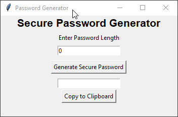

# Secure Password Generator


<hr>

## Quickstart
Run the exe to use the application.

## Requirements
To run the source code on your own machine you need:
* **[Python3](https://www.python.org/downloads/)**

* **[Tkinter](https://docs.python.org/3/library/tkinter.html)**

* **[pyperclip](https://pypi.org/project/PyQRCode/)**
```
pip install pyperclip
```
